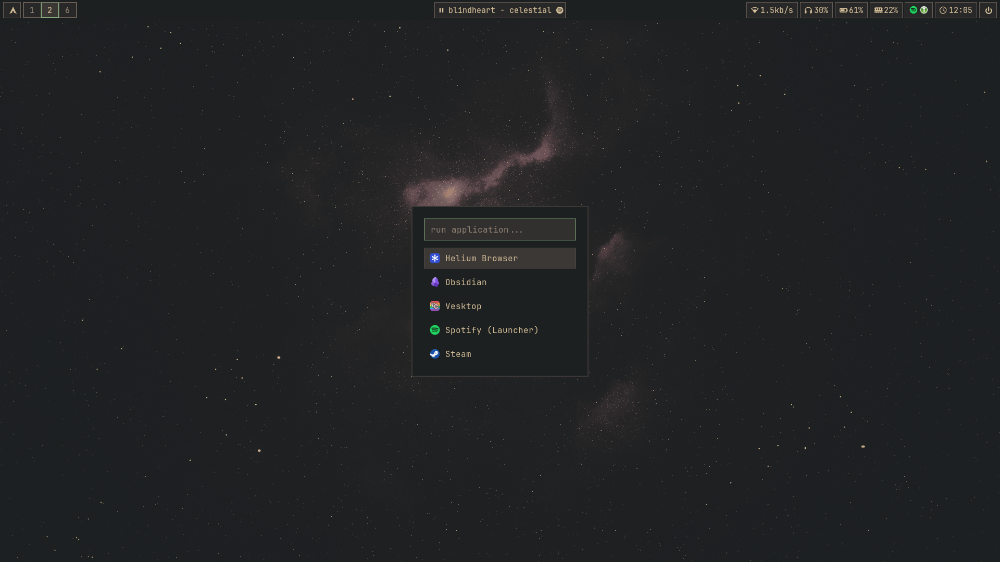
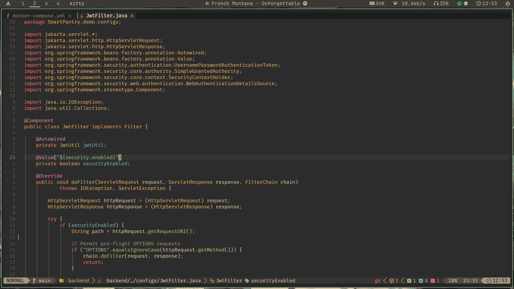
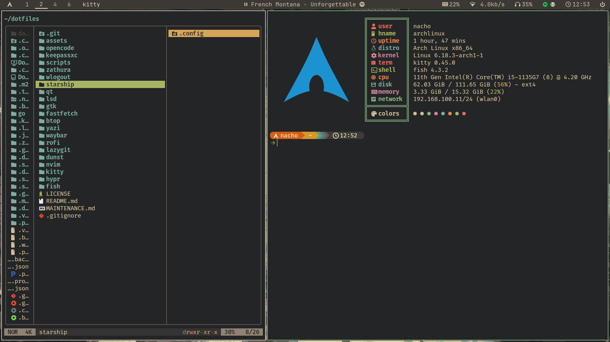

<div align="center">

# 💻 Hyprland Dotfiles

[](https://archlinux.org/)
[](https://wiki.hyprland.org/)
[](https://sw.kovidgoyal.net/kitty/)
[](https://neovim.io/)
[](https://fishshell.com/)
[](https://github.com/morhetz/gruvbox)

[](https://github.com/YOUR_USERNAME/dotfiles)
[](LICENSE)

A meticulously crafted, minimal yet functional Hyprland setup powered by Arch Linux.

---

<!-- SCREENSHOTS GO HERE -->
<!-- 


-->

[Get Started](#-installation) · [Features](#-features) · [Configuration](#-configuration) · [Credits](#-credits)

</div>

---

## 🌟 Features

| Feature | Description |
|---------|-------------|
| 🎨 **Consistent Theme** | Gruvbox Dark across all apps for visual harmony |
| ⚡ **Hyprland** | Tiling window manager with smooth animations |
| 🖥️ **Waybar** | Custom status bar with widgets |
| 🚀 **Neovim** | LazyVim configuration with LSP, treesitter, and plugins |
| 🐚 **Fish Shell** | Modern shell with custom functions |
| 📁 **Yazi** | TUI file manager with FZF integration |
| 🔧 **Automation** | Scripts for package installation and stow management |
| 🔒 **KeePassXC** | Encrypted password manager integration |

### Desktop Components

#### Window Manager
- **Hyprland** - Dynamic tiling Wayland compositor
- **Hyprpaper** - Wallpaper utility
- **Hyprlock** - Lock screen with blur effect
- **Hypridle** - Idle management

#### Applications
| App | Purpose |
|-----|---------|
|  | Terminal emulator |
|  | Text editor |
|  | File manager |
|  | Git TUI |
|  | Application launcher |
|  | Notification daemon |

---

## 📦 Installation

### Prerequisites

- Arch Linux or Arch-based distribution
- Git installed
- Sudo privileges

### Quick Install

```bash
# Clone the repository
git clone https://github.com/YOUR_USERNAME/dotfiles.git ~/dotfiles
cd ~/dotfiles

# Install all required packages
./scripts/install-packages.sh

# Apply dotfiles using stow
./scripts/stow.sh all

# Reboot or logout/login
```

### Manual Installation

<details>
<summary>Click to expand</summary>

#### 1. Clone Repository

```bash
git clone https://github.com/YOUR_USERNAME/dotfiles.git ~/dotfiles
cd ~/dotfiles
```

#### 2. Install Packages

Choose specific categories:

```bash
# Install all packages
./scripts/install-packages.sh

# Or install manually using pacman/yay
sudo pacman -S hyprland waybar rofi dunst kitty fish neovim
yay -S brave-bin visual-studio-code-bin vesktop
```

#### 3. Apply Dotfiles

```bash
# Install all configurations
./scripts/stow.sh all

# Or install specific packages
./scripts/stow.sh install hypr kitty nvim
```

#### 4. Set Default Shell (Optional)

```bash
# Set fish as default shell
chsh -s $(which fish)
```

#### 5. Reboot

```bash
reboot
```

</details>

---

## ⚙️ Configuration

### Package Management

#### Install Packages

```bash
cd ~/dotfiles
./scripts/install-packages.sh
```

This script installs:
- Base utilities and development tools
- Hyprland and Wayland components
- Terminal applications
- Audio/Video codecs
- Development tools (Go, Node.js, Java, Docker)
- Fonts and theming

#### Stow Management

```bash
# Install all dotfiles
./scripts/stow.sh all

# Install specific package
./scripts/stow.sh install hypr

# Remove a package
./scripts/stow.sh remove nvim

# Re-apply after changes
./scripts/stow.sh restow waybar

# Check symlink status
./scripts/stow.sh status

# List available packages
./scripts/stow.sh list
```

### Customization

#### Theme Colors

The theme is based on Gruvbox Dark. Main colors:

```vim
" Gruvbox Dark colors
let g:gruvbox_dark_background = '#1d2021'
let g:gruvbox_foreground = '#ebdbb2'
let g:gruvbox_bright_orange = '#d65d0e'
```

#### Hyprland Keybindings

Edit `hypr/.config/hypr/hyprland.conf`:

```ini
# Example keybinding
$mod = SUPER
bind = $mod, Return, exec, kitty
bind = $mod, D, exec, rofi -show drun
```

[Full keybinds documentation](hypr/.config/hypr/hyprland.conf)

#### Neovim

LazyVim based configuration. Add plugins in `nvim/.config/nvim/lua/plugins/`:

```lua
return {
  "tpope/vim-fugitive",
  event = "VeryLazy",
}
```

---

## 📸 Gallery

## Hyprland Workflow



**Workspace Management** - Tiling workspaces with gaps and borders


## Neovim Setup



**Development Environment** - LazyVim with LSP, treesitter, and status line


## File Manager and Terminal Setup



**Yazi** - Modern TUI file manager with FZF integration
**Fish Shell** - Custom prompt with starship and helpful functions

---

## 🛠️ Tech Stack

<div align="center">

### Core
[](https://archlinux.org/)
[](https://wiki.hyprland.org/)
[](https://github.com/Alexays/Waybar)

### Development
[](https://neovim.io/)
[](https://git-scm.com/)
[](https://github.com/jesseduffield/lazygit)

### Terminal
[](https://sw.kovidgoyal.net/kitty/)
[](https://fishshell.com/)
[](https://starship.rs/)

### Languages
[](https://go.dev/)
[](https://nodejs.org/)
[](https://python.org/)
[](https://openjdk.org/)

### Tools
[](https://www.docker.com/)
[](https://github.com/BurntSushi/ripgrep)
[](https://github.com/junegunn/fzf)

</div>

---

## 📁 Structure

```
~/dotfiles/
├── scripts/
│   ├── install-packages.sh   # Package installer
│   └── stow.sh               # Stow manager
├── hypr/                     # Hyprland configs
├── kitty/                    # Terminal configs
├── fish/                     # Shell configs & functions
├── nvim/                     # Neovim (LazyVim)
├── waybar/                   # Status bar
├── rofi/                     # Launcher
├── dunst/                    # Notifications
├── yazi/                     # File manager
├── lazygit/                  # Git TUI
├── btop/                     # System monitor
├── fastfetch/                # System info
├── lsd/                      # ls replacement
├── zathura/                  # PDF viewer
├── gtk/                      # GTK theming
├── qt/                       # Qt theming (Kvantum)
├── starship/                 # Prompt
├── opencode/                 # Opencode AI config
├── keepassxc/                # KeePassXC config
├── MAINTENANCE.md             # Detailed maintenance guide
└── README.md                 # This file
```

---

## 📝 Notes

### Adding New Configurations

See [MAINTENANCE.md](MAINTENANCE.md) for detailed instructions.

### Keyboard Shortcuts

| Shortcut | Action |
|----------|--------|
| `SUPER + Return` | Open terminal (kitty) |
| `SUPER + D` | Open launcher (rofi) |
| `SUPER + E` | Open file manager (yazi) |
| `SUPER + Shift + Q` | Kill active window |
| `SUPER + [1-9]` | Switch to workspace |
| `SUPER + Shift + [1-9]` | Move to workspace |
| `SUPER + H/J/K/L` | Move focus (vim-style) |
| `SUPER + Shift + H/J/K/L` | Swap windows |

### Troubleshooting

#### Hyprland not starting

```bash
# Check logs
journalctl -xe | grep hyprland

# Check config
hyprctl config reload
```

#### Symlinks not working

```bash
# Check status
cd ~/dotfiles
./scripts/stow.sh status

# Re-apply
./scripts/stow.sh restow all
```

---

## 🤝 Contributing

Feel free to fork this repo and customize it to your liking. If you find bugs or have suggestions, open an issue.

1. Fork the repository
2. Create your feature branch (`git checkout -b feature/AmazingFeature`)
3. Commit your changes (`git commit -m 'feat: add some AmazingFeature'`)
4. Push to the branch (`git push origin feature/AmazingFeature`)
5. Open a Pull Request

---

## 📄 License

[](LICENSE)

This repository is licensed under the MIT License - see the [LICENSE](LICENSE) file for details.

---

## 🙏 Credits & Inspiration

- [Hyprland](https://github.com/hyprwm/Hyprland) - Dynamic tiling Wayland compositor
- [LazyVim](https://github.com/LazyVim/LazyVim) - Neovim configuration
- [Gruvbox](https://github.com/morhetz/gruvbox) - Retro groove color scheme
- [Arch Linux](https://archlinux.org/) - The lightweight and flexible Linux distribution

---

<div align="center">

**⭐ Star this repo if it helped you!**

Made with ❤️ by [Nacho](https://github.com/NachoOsella)

</div>
