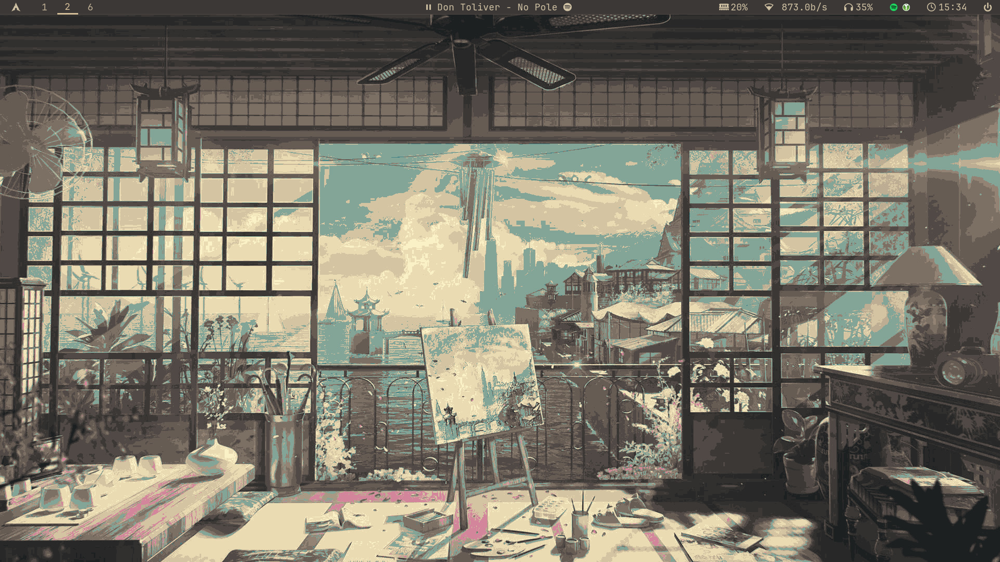
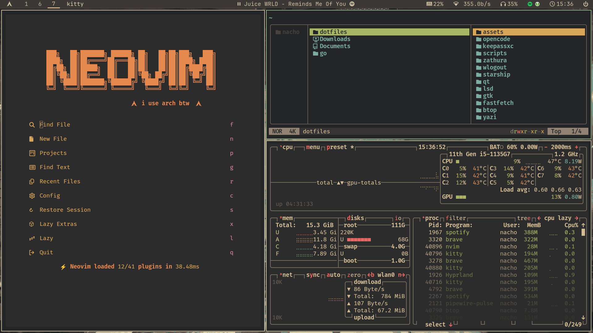

<div align="center">



# ⚡ Hyprland Dotfiles

[](https://archlinux.org/)
[](https://wiki.hyprland.org/)
[](https://neovim.io/)
[](https://github.com/morhetz/gruvbox)

<br/>

**A meticulously crafted, minimal, and functional Hyprland setup powered by Arch Linux.**
<br/>
*Aesthetic • Performance • Workflow*

<br/>

[Installation](#-installation) · [Features](#-features) · [Gallery](#-gallery) · [Configuration](#-configuration)

<br/>



</div>

<br/>

---

## ✨ Features

A comprehensive environment focused on keyboard-driven productivity and visual consistency.

| Category | Component | Description |
|----------|-----------|-------------|
| **Window Manager** | Hyprland | Dynamic tiling with smooth animations and blur |
| **Theme** | Gruvbox Dark | Consistent color scheme across all applications |
| **Terminal** | Kitty | GPU-accelerated terminal with ligature support |
| **Editor** | Neovim | LazyVim distribution for a full IDE experience |
| **Shell** | Fish | Modern shell with autosuggestions and starship prompt |
| **File Manager** | Yazi | Blazing fast TUI file manager with image preview |
| **Bar** | Waybar | Highly customizable status bar with functional modules |
| **Launcher** | Rofi | Application launcher and power menu |

---

## 📸 Gallery

<div align="center">

### Workflow & Launcher


### Neovim Development


### Terminal & Files


</div>

---

## 📦 Installation

<details>
<summary><strong>Quick Start</strong></summary>

```bash
# 1. Clone the repository
git clone https://github.com/NachoOsella/DotFiles-V4.git ~/dotfiles
cd ~/dotfiles

# 2. Install dependencies
./scripts/install-packages.sh

# 3. Apply configurations
./scripts/stow.sh all

# 4. Reboot
reboot
```
</details>

<details>
<summary><strong>Manual Installation</strong></summary>

If you prefer more control, you can install components individually.

```bash
# Clone
git clone https://github.com/NachoOsella/DotFiles-V4.git ~/dotfiles
cd ~/dotfiles

# Install specific packages (e.g., just hyprland and kitty)
sudo pacman -S hyprland kitty

# Link specific configs
./scripts/stow.sh install hypr kitty
```
</details>

---

## ⚙️ Configuration

### Directory Structure

```tree
~/dotfiles/
├── hypr/       # Window Manager
├── nvim/       # Editor (LazyVim)
├── fish/       # Shell config
├── kitty/      # Terminal
├── waybar/     # Status bar
├── rofi/       # Launcher
└── scripts/    # Automation
```

### Keybindings

| Key | Action |
|-----|--------|
| `SUPER + Enter` | Open Terminal |
| `SUPER + D` | Open Launcher |
| `SUPER + E` | File Manager |
| `SUPER + Q` | Close Window |
| `SUPER + 1-9` | Switch Workspace |

> Check `hypr/.config/hypr/hyprland.conf` for the full list.

---

## 🛠️ Tech Stack

<div align="center">
  
</div>

---

## 🤝 Contributing

Contributions are welcome! Please feel free to submit a Pull Request.

1. Fork the Project
2. Create your Feature Branch (`git checkout -b feature/AmazingFeature`)
3. Commit your Changes (`git commit -m 'Add some AmazingFeature'`)
4. Push to the Branch (`git push origin feature/AmazingFeature`)
5. Open a Pull Request

---

<div align="center">

[](LICENSE)
<br/>
Made with ❤️ by <a href="https://github.com/NachoOsella">Nacho</a>

</div>
