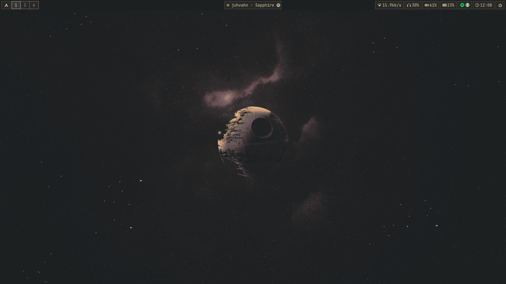
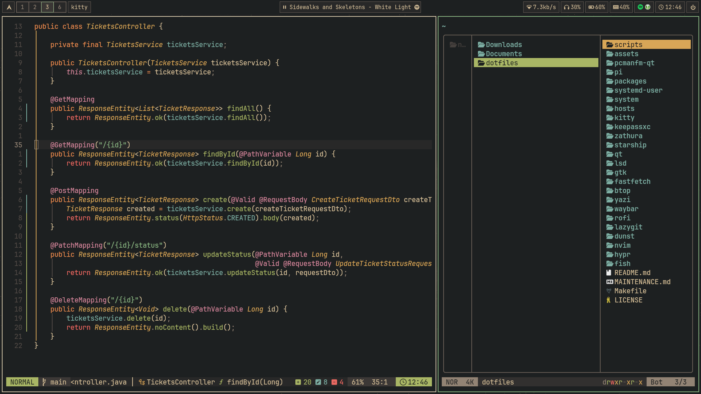
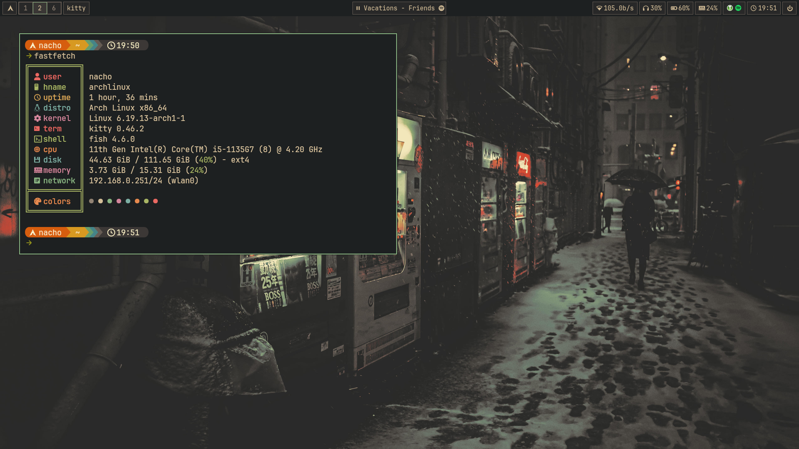

<div align="center">



# Hyprland Dotfiles

[](https://archlinux.org/)
[](https://wiki.hyprland.org/)
[](https://neovim.io/)
[](https://github.com/sainnhe/gruvbox-material)

<br/>

**My personal Arch + Hyprland setup with warm Gruvbox colors, sharp rectangles and a keyboard-first workflow.**

<br/>

Kitty · Fish · Starship · Waybar · Rofi · Neovim · Yazi · Fastfetch

</div>

---

## Preview

<div align="center">

### Launcher


### Development


### Terminal


</div>

---

## Before you install

> Warning
> These are my personal Arch Linux + Hyprland dotfiles.
> The full bootstrap can install packages, write system configuration under `/etc`,
> link user configs with GNU Stow, and enable, disable, or mask systemd services.
> Read the scripts and run `--dry-run` before applying the full setup.

This repository is best used as inspiration or as a starting point for your own setup.
It is not intended to be a universal one-command installer for every machine.

---

## Install modes

### Safe user config only

Use this mode if you only want to link user-level dotfiles such as Hyprland, Kitty,
Fish, Neovim, Waybar, Rofi, Yazi, and related configs.

```bash
git clone https://github.com/NachoOsella/DotFiles-V4.git ~/dotfiles
cd ~/dotfiles
./scripts/install-user.sh
```

This mode does not install packages, does not write to `/etc`, and does not change
systemd services.

If you only want specific configs, install individual Stow packages instead of
running the full user install:

```bash
./scripts/stow.sh install kitty nvim waybar
```

You can list the available Stow packages with:

```bash
./scripts/stow.sh list
```

To preview what Stow would link before applying changes, run:

```bash
stow -n -v kitty nvim waybar
```

### Preview full Arch bootstrap

Use dry-run mode before running the full bootstrap:

```bash
./scripts/bootstrap.sh --dry-run
```

### Full Arch bootstrap

Use this only on an Arch Linux machine where you want to reproduce my full system
setup:

```bash
./scripts/bootstrap.sh --yes
```

Then reboot:

```bash
reboot
```

The full bootstrap installs packages, applies system configuration, links dotfiles,
and enables the configured services. If you omit `--yes`, the script asks for an
explicit confirmation before changing the system.

---

## What the full bootstrap can change

- Installs official packages from `packages/pacman.txt` and host overlays.
- Installs AUR packages from `packages/aur.txt` and host overlays.
- Copies versioned system files from `system/etc` and `hosts/<host>/system/etc` to `/etc`.
- Links user configuration with GNU Stow.
- Enables system and user services declared under `hosts/<host>/services`.
- Can disable and mask conflicting system units declared in host service manifests.

---

## What it sets up

- Hyprland desktop with a dark vending-machine wallpaper.
- Gruvbox Material Dark Hard theme across the terminal, launcher, editor and bar.
- Waybar with workspaces, media, network, audio, battery, memory and clock modules.
- Kitty + Fish + Starship for the terminal workflow.
- Neovim and Yazi side by side for coding and file navigation.
- Rofi launcher styled to match the rest of the desktop.
- Fastfetch for a clean system overview.

---

<div align="center">

[](LICENSE)

Made by <a href="https://github.com/NachoOsella">Nacho</a>

</div>
