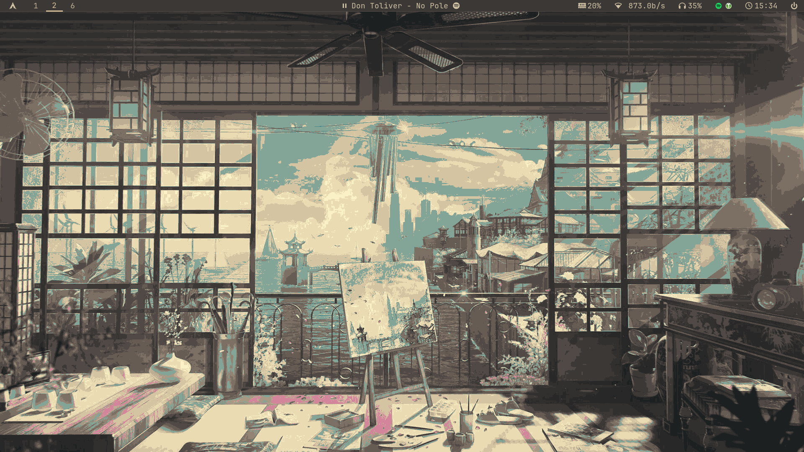
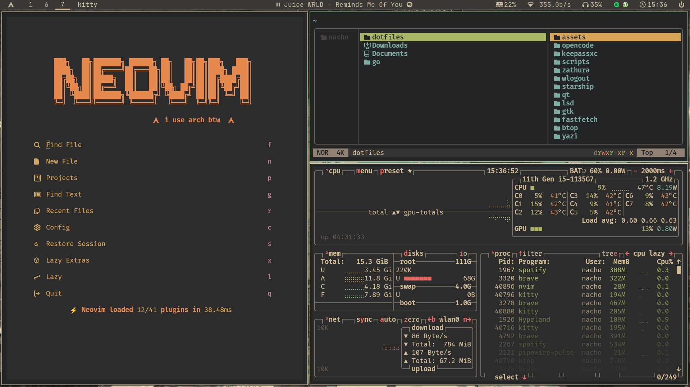
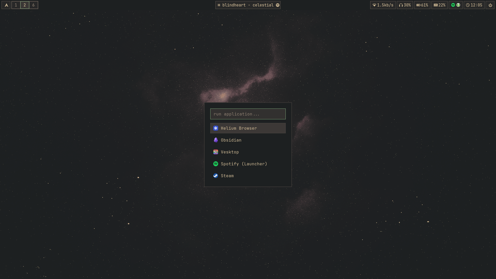
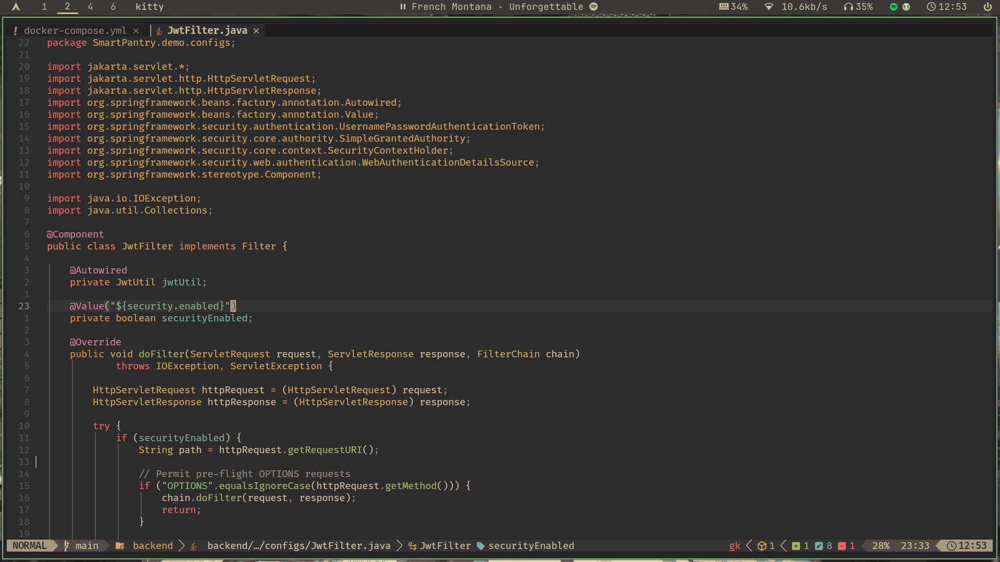
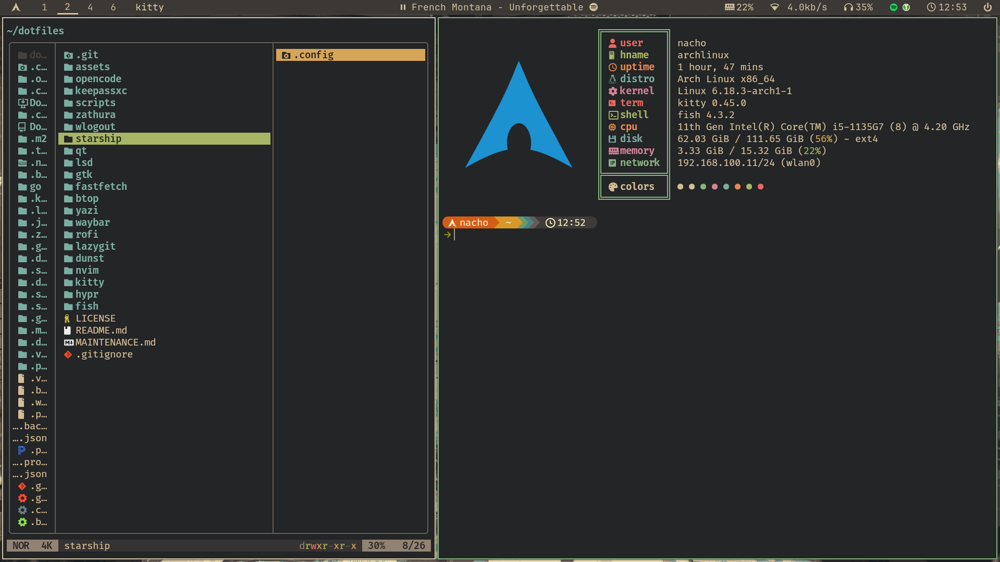

<div align="center">



# ⚡ Hyprland Dotfiles + System Bootstrap

[](https://archlinux.org/)
[](https://wiki.hyprland.org/)
[](https://neovim.io/)
[](https://github.com/morhetz/gruvbox)

<br/>

**A reproducible Arch Linux setup with Hyprland, user dotfiles, system config, and bootstrap automation.**
<br/>
*Aesthetic • Provisioning • Workflow*

<br/>

[Installation](#-installation) · [Features](#-features) · [Gallery](#-gallery) · [Configuration](#-configuration)

<br/>



</div>

<br/>

---

## ✨ Features

A comprehensive environment focused on keyboard-driven productivity and visual consistency.

| Category | Component | Description |
|----------|-----------|-------------|
| **Window Manager** | Hyprland | Dynamic tiling with smooth animations and blur |
| **Theme** | Gruvbox Dark | Consistent color scheme across all applications |
| **Terminal** | Kitty | GPU-accelerated terminal with ligature support |
| **Editor** | Neovim | LazyVim distribution for a full IDE experience |
| **Shell** | Fish | Modern shell with autosuggestions and starship prompt |
| **File Manager** | Yazi | Blazing fast TUI file manager with image preview |
| **Bar** | Waybar | Highly customizable status bar with functional modules |
| **Launcher** | Rofi | Application launcher and power menu |
| **Provisioning** | Bash + Stow | Reproducible install flow for packages, `/etc`, services and user config |
| **Power** | TLP | Battery thresholds and laptop power configuration |
| **Network** | NetworkManager + iwd | Global wireless backend and service state managed from the repo |

---

## 📸 Gallery

<div align="center">

### Workflow & Launcher


### Neovim Development


### Terminal & Files


</div>

---

## 📦 Installation

This repository now manages:

- user dotfiles with `stow`
- explicit package manifests for `pacman` and AUR
- selected global config under `/etc`
- system and user `systemd` services
- host-specific overrides

<details>
<summary><strong>Quick Start</strong></summary>

```bash
# 1. Clone the repository
git clone https://github.com/NachoOsella/DotFiles-V4.git ~/dotfiles
cd ~/dotfiles

# 2. Bootstrap the machine
./scripts/bootstrap.sh

# 3. Reboot
reboot
```
</details>

<details>
<summary><strong>Manual Installation</strong></summary>

If you prefer more control, you can install components individually.

```bash
# Clone
git clone https://github.com/NachoOsella/DotFiles-V4.git ~/dotfiles
cd ~/dotfiles

# Install packages from manifests
./scripts/install-packages.sh

# Apply versioned /etc config
./scripts/apply-system.sh

# Link user config
./scripts/stow.sh install

# Enable declared services
./scripts/enable-services.sh
```
</details>

---

## ⚙️ Configuration

### Directory Structure

```tree
~/dotfiles/
├── packages/     # Package manifests (pacman/AUR)
├── hosts/        # Host-specific overlays
├── system/       # Versioned /etc files
├── systemd-user/ # User units managed with stow
├── hypr/         # Window Manager
├── nvim/         # Editor (LazyVim)
├── fish/         # Shell config
├── kitty/        # Terminal
├── waybar/       # Status bar
├── rofi/         # Launcher
└── scripts/      # Automation
```

### Provisioning Flow

```bash
# Apply everything on the current host
./scripts/bootstrap.sh

# Refresh package manifests from the current machine
./scripts/capture-system.sh

# Validate manifests and scripts
./scripts/check.sh
```

### Managed System Areas

- `system/etc/NetworkManager/conf.d/`
  - Global NetworkManager behavior, including `iwd` backend.
- `hosts/<host>/system/etc/tlp.d/`
  - Host-specific TLP battery thresholds.
- `hosts/<host>/services/*.txt`
  - Services to enable and conflicting units to disable or mask.

### Real Host State Captured

The current `archlinux` host profile includes:

- `NetworkManager.service` and `iwd.service` as the active networking stack
- `wpa_supplicant.service` and `systemd-networkd*` disabled/masked to avoid conflicts
- TLP charge thresholds at `40/60`

### Keybindings

| Key | Action |
|-----|--------|
| `SUPER + Enter` | Open Terminal |
| `SUPER + D` | Open Launcher |
| `SUPER + E` | File Manager |
| `SUPER + Q` | Close Window |
| `SUPER + 1-9` | Switch Workspace |

> Check `hypr/.config/hypr/hyprland.conf` for the full list.

---

## 🛠️ Tech Stack

<div align="center">
  
</div>

---

## 🤝 Contributing

Contributions are welcome! Please feel free to submit a Pull Request.

1. Fork the Project
2. Create your Feature Branch (`git checkout -b feature/AmazingFeature`)
3. Commit your Changes (`git commit -m 'Add some AmazingFeature'`)
4. Push to the Branch (`git push origin feature/AmazingFeature`)
5. Open a Pull Request

---

<div align="center">

[](LICENSE)
<br/>
Made with ❤️ by <a href="https://github.com/NachoOsella">Nacho</a>

</div>
