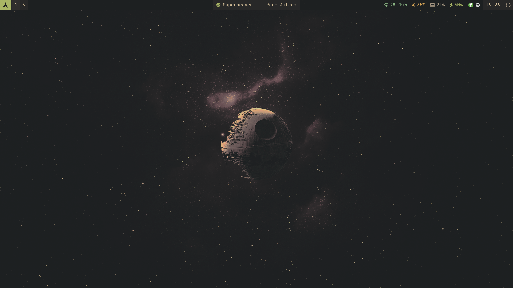
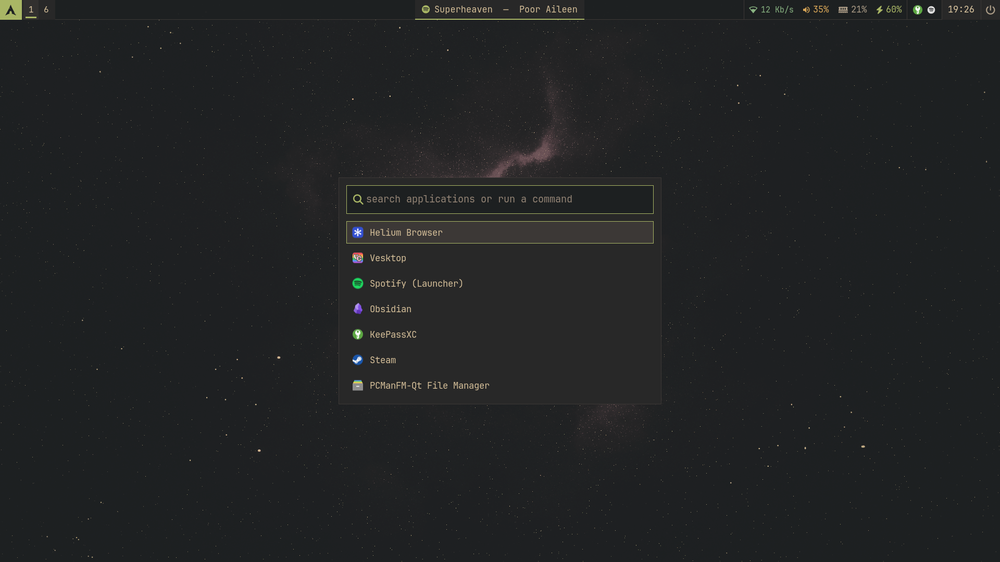
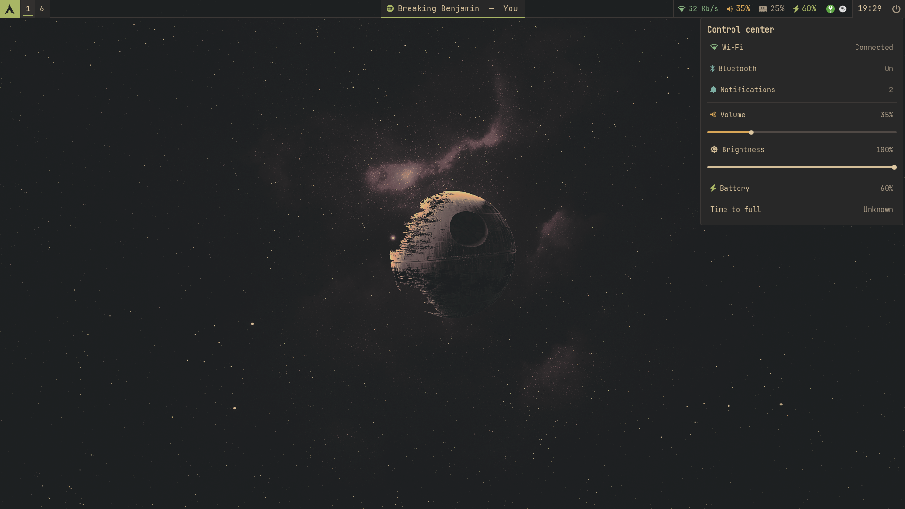
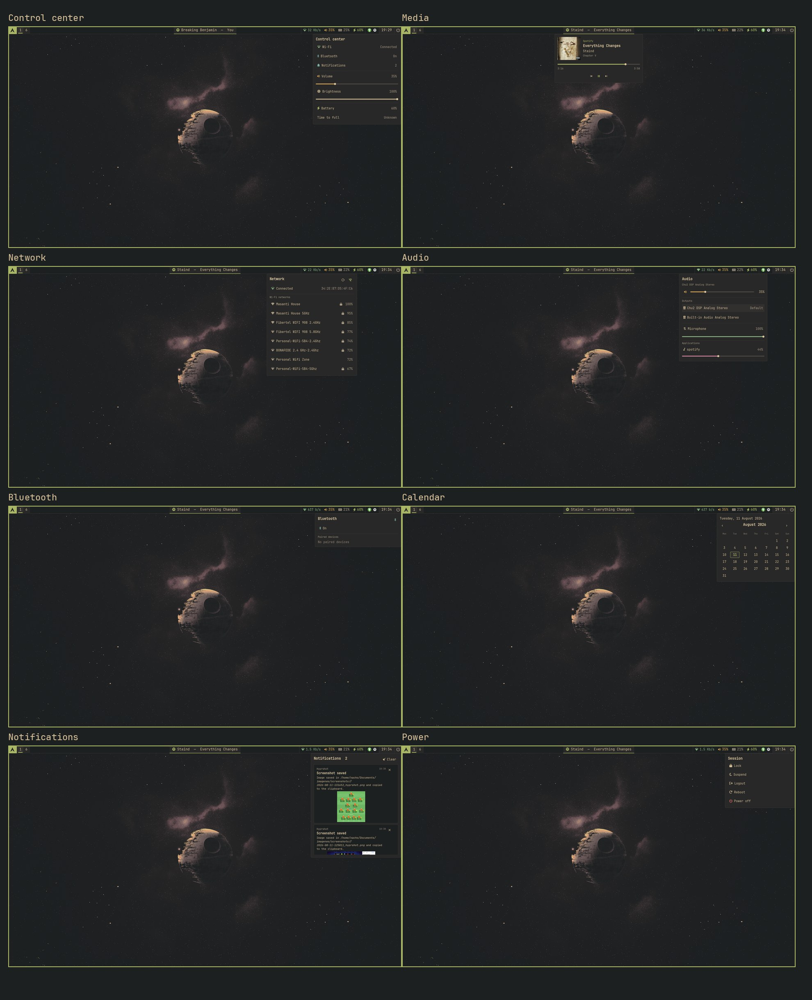
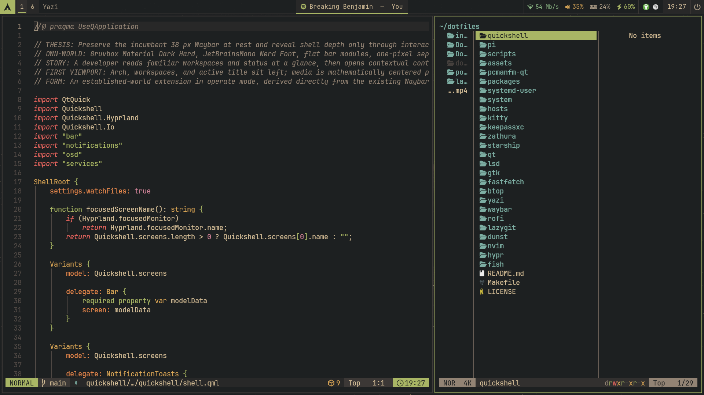
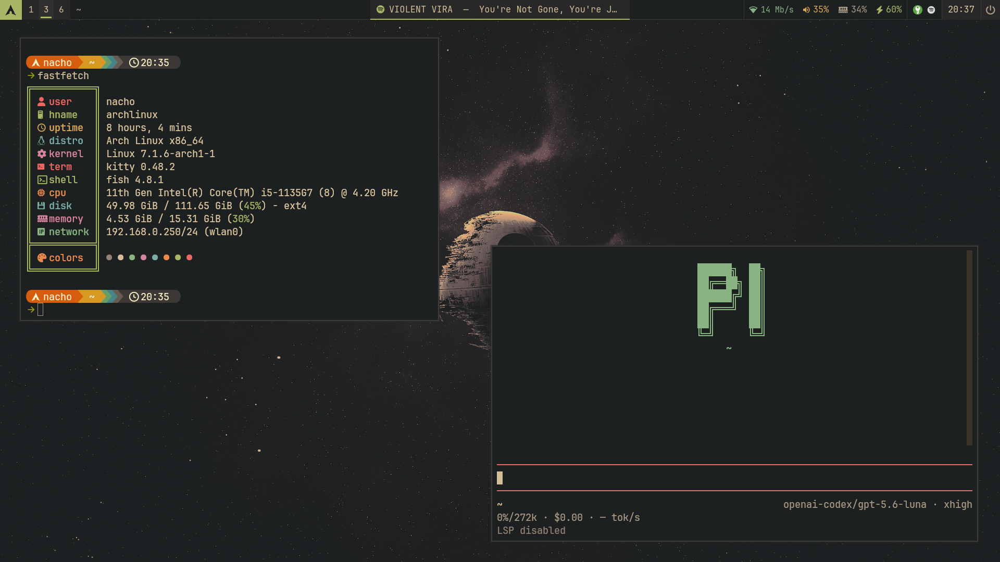

<div align="center">



# Hyprland dotfiles

[](https://archlinux.org/)
[](https://wiki.hyprland.org/)
[](https://neovim.io/)
[](https://github.com/sainnhe/gruvbox-material)

Arch + Hyprland the way I actually use it. Warm Gruvbox Material Hard, sharp rectangles, no animations I did not ask for, and everything reachable without leaving the keyboard.

Kitty · Fish · Starship · Quickshell · Rofi · Neovim · Yazi · Fastfetch

</div>

---

## Stack

I keep it simple. One tool per job, all tied together with Gruvbox Material Dark Hard.

| Area | What I use |
| --- | --- |
| Window manager | Hyprland with Hyprlock, Hypridle and Hyprpaper |
| Shell | Fish + Starship |
| Terminal | Kitty |
| Editor | Neovim on top of LazyVim |
| Launcher | Rofi |
| Bar and desktop widgets | Quickshell. Waybar config is still in the repo for reference |
| File management | Yazi in the terminal, pcmanfm-qt for the rest |
| System | PipeWire, NetworkManager with iwd, TLP, SDDM, Dunst, btop, Fastfetch, zathura, KeePassXC |

Wallpapers live in `assets/wallpapers`. The Death Star one in the header is the default.

## Preview

<div align="center">

### Launcher


### Quickshell


### Quickshell widgets


### Development


### Pi + Fastfetch


</div>

---

## Getting started

> [!WARNING]
> These are my personal dotfiles. The full bootstrap can install packages, copy files to `/etc`, link configs with GNU Stow, and enable or mask systemd services. Skim the scripts first and run with `--dry-run` if you are not on my machine.

### Prerequisites

- Arch Linux. The bootstrap assumes `pacman` and `yay`.
- GNU Stow for the safe path. `sudo pacman -S stow`.
- Git.

If you just want a few configs, you do not need Arch. Stow works on any distro.

### 1. Clone

```bash
git clone https://github.com/NachoOsella/DotFiles-V4.git ~/dotfiles
cd ~/dotfiles
```

### 2. Pick how far you want to go

**A. Just the dotfiles. This is the safe default.**

Best if you want to steal an app or two without touching your system.

```bash
# every user config in the repo
./scripts/install-user.sh

# or pick what you need
./scripts/stow.sh install kitty nvim quickshell
./scripts/stow.sh list
```

Preview before you link:

```bash
stow -n -v kitty nvim quickshell
```

This path never installs packages, never writes to `/etc`, and never touches services.

**B. Full system bootstrap. Arch only, and mostly for me.**

This reproduces my whole machine. Run a dry run first. It shows exactly what would change and asks for nothing.

```bash
./scripts/bootstrap.sh --dry-run
./scripts/bootstrap.sh --yes
reboot
```

Without `--yes`, the script asks you to type `bootstrap` by hand. That pause is on purpose.

Useful flags:

```bash
./scripts/bootstrap.sh --dry-run --skip-packages   # skip pacman and AUR
./scripts/bootstrap.sh --skip-system               # skip files in /etc
./scripts/bootstrap.sh --skip-services             # skip systemd changes
./scripts/bootstrap.sh --host archlinux            # force a host overlay
```

> [!TIP]
> Start small. Even on Arch, I recommend linking a couple of Stow packages first and living with them for a day before you run the full bootstrap.

## How the repo is organized

Everything is a Stow package. Each folder at the root maps to `~/.config` or similar.

```
dotfiles/
├── assets/               # screenshots and wallpapers
├── hypr/                 # Hyprland, Hyprlock, Hypridle, Hyprpaper, keybinds in hypr/binds.lua
├── quickshell/           # bar, control center, media, network, notifications, OSD
├── kitty/ fish/ starship/# terminal stack
├── nvim/                 # LazyVim setup, plugins in lua/plugins/
├── rofi/                 # launcher, powermenu, wifi, clipboard and emoji menus
├── yazi/ btop/ fastfetch/ lsd/ zathura/ waybar/ dunst/ gtk/ qt/ ...
├── packages/
│   ├── pacman.txt        # 128 official packages
│   └── aur.txt           # AUR helpers and extras
├── hosts/archlinux/      # per-host overlays for packages, /etc and services
├── system/etc/           # versioned system config copied to /etc by bootstrap
└── scripts/
    ├── bootstrap.sh      # full setup. packages + system + stow + services
    ├── install-user.sh   # safe alias for stow.sh install
    ├── stow.sh           # conflict-aware wrapper around GNU Stow
    ├── install-packages.sh / apply-system.sh / enable-services.sh
    └── preflight.sh / check.sh
```

Host-specific things live under `hosts/<host>`. If your hostname matches, the scripts layer those files on top of the defaults.

## What the bootstrap does when you let it

No surprises. Each step is a separate script you can run on its own.

- Installs packages from `packages/pacman.txt` and `packages/aur.txt`, plus any `hosts/<host>/packages` overlay.
- Copies system config from `system/etc` and `hosts/<host>/system/etc` into `/etc`. That covers NetworkManager with iwd, TLP, and a few defaults.
- Links user configs with GNU Stow. It checks for conflicts first and will not overwrite your files silently.
- Enables services listed in `hosts/<host>/services/system.txt` and `user.txt`, and masks anything in `system-disable.txt`. On this host that means bluetooth, docker, NetworkManager, sddm, tlp and a few timers for user services like pipewire and wireplumber.

Prefer the smaller scripts when you only want part of it:

```bash
./scripts/preflight.sh --dry-run
./scripts/install-packages.sh --dry-run
./scripts/apply-system.sh --dry-run
./scripts/enable-services.sh --dry-run
```

## A few notes

I use this setup every day, so I optimize for speed over novelty. Super + Return opens Kitty. Super + D opens Rofi. Super + h j k l moves focus, add Shift to move windows, add Ctrl to resize. Workspaces are Super + 1..0. The rest is in `hypr/.config/hypr/hypr/binds.lua`.

If something looks off after stowing, run `stow -R` on that package or `scripts/check.sh` to see what the bootstrap expects.

Steal what you like, ignore the rest. If you fork it, make it yours. That is the whole point of dotfiles.
