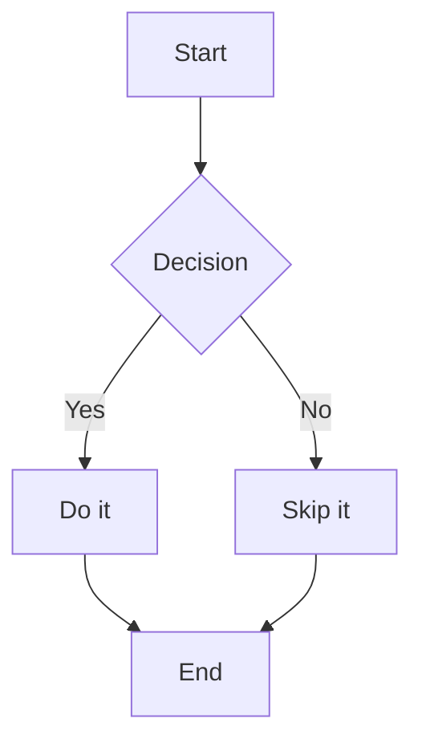

# Presenterm Skill

Produce beautiful, presentation-ready `.md` files for [presenterm](https://github.com/mfontanini/presenterm) — a terminal-native slideshow tool. The output is a single Markdown file the user can run directly with `presenterm slides.md`.

---

## Quick Reference (CLI)

```bash
presenterm slides.md                        # Run (auto hot-reloads on save)
presenterm --theme tokyonight-storm s.md    # Override theme
presenterm --present slides.md             # Presentation mode (no hot-reload)
presenterm --list-themes                   # Preview all themes interactively
presenterm -e slides.md                    # Export to PDF
presenterm -E slides.md                    # Export to HTML
presenterm -x slides.md                    # Enable code block execution
presenterm --publish-speaker-notes s.md    # Main instance (publish notes)
presenterm --listen-speaker-notes s.md     # Speaker notes display instance
```

---

## File Structure

```
[YAML front matter]      <- title, author, theme, event, date, location
                         <- auto-generates a styled intro slide
[slide content]
<!-- end_slide -->        <- slide separator (NEVER use ---)
[slide content]
<!-- end_slide -->
...
```

---

## Front Matter

```yaml
---
title: "**My** _First_ Presentation"   # supports inline markdown
sub_title: Running from the terminal
author: Jane Dev
# Multiple authors:
# authors:
#   - Jane Dev
#   - Bob Eng
event: RustConf 2025
location: San Francisco
date: "2025-10-01"
theme:
  name: tokyonight-storm
---
```

All front-matter fields (`author`, `event`, `location`, `date`, `title`, `sub_title`) are available as `{variable}` in footer templates.

---

## Built-in Themes

```bash
presenterm --list-themes   # Preview all themes in an interactive slideshow
```

| Theme | Style |
|---|---|
| `tokyonight-storm` | Best default — vibrant blue/purple, modern dev |
| `tokyonight-night` | Darker tokyonight variant |
| `tokyonight-moon` | Softer moon tones |
| `tokyonight-day` | Light tokyonight |
| `catppuccin-mocha` | Warm pastel dark (very popular) |
| `catppuccin-macchiato` | Slightly lighter mocha |
| `catppuccin-frappe` | Medium contrast pastel |
| `catppuccin-latte` | Light pastel |
| `gruvbox-dark` | Retro amber/green warm dark |
| `dark` | Simple dark fallback |
| `light` | Simple light / projected rooms |
| `terminal-dark` | Inherits terminal palette (dark) |
| `terminal-light` | Inherits terminal palette (light) |

**Auto light/dark detection:**
```yaml
---
theme:
  light: catppuccin-latte
  dark: catppuccin-mocha
---
```

---

## Theme Overrides (inline, no external files needed)

Override any part of any theme directly in the front matter:

```yaml
---
theme:
  name: tokyonight-storm
  override:
    default:
      margin:
        percent: 8
      colors:
        foreground: "cdd6f4"
        background: "1e1e2e"
    slide_title:
      prefix: "▌"
      font_size: 2
      bold: true
      separator: true
      padding_top: 1
      padding_bottom: 1
      colors:
        foreground: "89b4fa"
    headings:
      h1:
        prefix: "██ "
        bold: true
        colors:
          foreground: "89b4fa"
      h2:
        prefix: "▓▓ "
        colors:
          foreground: "a6e3a1"
      h3:
        prefix: "░░ "
        italics: true
    footer:
      style: template
      left: "{author}"
      center: "{event}"
      right: "{current_slide} / {total_slides}"
      height: 2
    code:
      theme_name: base16-eighties.dark
      padding:
        horizontal: 2
        vertical: 1
      background: true
      line_numbers: false
    block_quote:
      prefix: "▍ "
    bold:
      colors:
        foreground: "f9e2af"
    italics:
      colors:
        foreground: "cba6f7"
    mermaid:
      background: transparent
      theme: dark
---
```

**Best code highlight themes:**
- `base16-eighties.dark` — classic dark
- `Catppuccin` — matches catppuccin themes perfectly
- `gruvbox` — warm retro
- `dracula-sublime` — purple/pink
- `Nord-sublime` — arctic blue
- `TwoDark` — atom-style
- `visual-studio-dark-plus` — familiar VS Code look

**Footer styles:**
```yaml
footer:
  style: template      # left/center/right text with variables
  style: progress_bar  # bar that advances as slides progress (optional character: emoji)
  style: empty         # no footer
```

**Footer with images** (e.g. company logo):
```yaml
footer:
  style: template
  left:
    image: logo.png    # relative to presentation file
  right: "{current_slide} / {total_slides}"
  height: 5
```

**Color palette** (define once, reuse everywhere):
```yaml
theme:
  override:
    palette:
      colors:
        accent: "89b4fa"
        warn: "f38ba8"
      classes:
        highlight:
          foreground: "1e1e2e"
          background: "89b4fa"
```
Use in text: `<span style="color: palette:accent">colored text</span>`
Use as class: `<span class="highlight">highlighted</span>`

**Extend a theme** (in a custom theme YAML file):
```yaml
extends: dark
default:
  colors:
    background: "000000"
```

---

## Slide Separator

```
<!-- end_slide -->
```

This is the ONLY valid slide separator. Do NOT use `---`.

---

## Slide Titles (Setext Style)

```markdown
My Slide Title
===
```

Setext headers get special full-width styled rendering with font size, separator, etc. ATX headers (`#`, `##`, `###`) are styled as in-slide headings.

---

## Colored Text (Inline)

```markdown
<span style="color: #ff6b6b">red text</span>
<span style="color: #89b4fa; background-color: #1e1e2e">blue on dark</span>
<span style="color: palette:accent">uses palette color</span>
<span class="highlight">uses palette class</span>
```

Only `<span>` tags are supported. No other HTML.

---

## GitHub-Style Alerts

```markdown
> [!NOTE]
> Useful information that users should know.

> [!TIP]
> Helpful advice for doing things better.

> [!IMPORTANT]
> Key information users need to succeed.

> [!WARNING]
> Urgent info that needs immediate attention.

> [!CAUTION]
> Advises about risks or negative outcomes.
```

---

## Images

```markdown
              # original size
         # 50% of terminal width
              # shorthand for width
```

**Key rules:**
- Paths are **relative to the presentation file**
- Remote URLs are NOT supported (by design)
- Renders natively in: kitty, iterm2, WezTerm, ghostty, foot
- Falls back to ASCII blocks in unsupported terminals
- Images auto-resize to fit terminal preserving aspect ratio
- In tmux: add `set -g allow-passthrough on` to `.tmux.conf`

**Forcing image protocol** (if auto-detection fails):
```bash
presenterm --image-protocol iterm2 slides.md
presenterm --image-protocol kitty-local slides.md
presenterm --image-protocol ascii-blocks slides.md   # forced ASCII fallback
```

---

## Comment Commands (Full Reference)

### Slide control
```
<!-- end_slide -->            End slide, start next
<!-- skip_slide -->           Exclude this slide from presentation
<!-- no_footer -->            Hide footer on this slide only
```

### Progressive reveal
```
<!-- pause -->                               Pause, reveal on next key press
<!-- incremental_lists: true -->             Auto-pause after each list item
<!-- incremental_lists: false -->            Turn off incremental lists
```

### Layout and spacing
```
<!-- jump_to_middle -->                      Jump to vertical center of slide
<!-- new_line -->                            Insert one blank line
<!-- new_lines: 5 -->                        Insert N blank lines
<!-- alignment: center -->                   Align rest of slide (left/center/right)
<!-- list_item_newlines: 2 -->               Space N lines between list items
<!-- font_size: 2 -->                        Set font size 1-7 (kitty terminal only)
```

### Columns
```
<!-- column_layout: [3, 2] -->               Define column proportions
<!-- column: 0 -->                           Enter column by 0-based index
<!-- reset_layout -->                        Exit column layout, return to full width
```

### Content and notes
```
<!-- include: other.md -->                   Include external markdown file
<!-- speaker_note: your note here -->        Speaker note (hidden from audience)
<!--
speaker_note: |
  Multiline note line 1
  Multiline note line 2
-->
```

### User comments (never rendered)
```
<!-- // private note or TODO -->
<!-- comment: source reference here -->
```

---

## Incremental Lists

Much cleaner than scattering `<!-- pause -->` between every bullet:

```markdown
<!-- incremental_lists: true -->

- This bullet appears first
- Then this one
- Then this one

<!-- incremental_lists: false -->

- This list
- Shows all at once
```

---

## Jump to Middle (Section Divider Slides)

Perfect for dramatic section breaks:

```markdown
<!-- end_slide -->

<!-- jump_to_middle -->

Part II — Advanced Topics
===

<!-- end_slide -->
```

---

## Column Layouts

```markdown
My Slide
===

<!-- column_layout: [3, 2] -->

<!-- column: 0 -->

Content in left column (60% width)

<!-- column: 1 -->

Content in right column (40% width)

<!-- reset_layout -->

Full-width content below columns.
```

**Common patterns:**
- `[2, 1]` — code left, notes right
- `[1, 2, 1]` — centered content (write only in middle column)
- `[1, 1]` — equal two-column split
- `[3, 2]` — slightly wider left

**Debug columns:** Press `T` while presenting to toggle the layout grid.

---

## Code Blocks

### Basic syntax highlighting
````markdown
```python
def greet(name: str) -> str:
    return f"Hello, {name}!"
```
````

### Line numbers
````markdown
```rust +line_numbers
fn main() {
    println!("Hello!");
}
```
````

### Static selective highlight
````markdown
```python {1,3-5}
def process(data):
    raw = load(data)          # line 2 — dim
    cleaned = clean(raw)      # line 3 — highlighted
    result = analyze(cleaned) # line 4 — highlighted
    return result             # line 5 — highlighted
```
````

### Dynamic highlight (advances on key press)
````markdown
```rust {1-3|5-9|11-13}
struct Config {
    timeout: u32,
    retries: u8,
}

impl Config {
    fn new() -> Self {
        Config { timeout: 30, retries: 3 }
    }
}

fn main() {
    let cfg = Config::new();
}
```
````

### Executable code block
````markdown
```bash +exec
echo "Live output appears below"
date && uptime
```
````
Run with `presenterm -x slides.md`, execute with `Ctrl+E`.

**Supported languages:** ada, awk, bash, C, C++, C#, clojure, cmake, css, D, diff, docker, dotenv, elixir, elm, erlang, go, haskell, html, java, javascript, json, kotlin, latex, lua, makefile, markdown, nix, ocaml, perl, php, protobuf, python, R, rust, scala, shell, sql, swift, svelte, terraform, typescript, xml, yaml, vue, zig (and more).

---

## Mermaid Diagrams

````markdown

````

Requires: `npm install -g @mermaid-js/mermaid-cli`

---

## LaTeX / Math Formulas

````markdown
```latex +render
\frac{-b \pm \sqrt{b^2 - 4ac}}{2a}
```
````

Renders as an inline image. Requires `latex` + `dvisvgm`.

---

## Speaker Notes (Two-instance Setup)

```markdown
Normal slide content visible to audience.

<!-- speaker_note: Mention the benchmark data here -->

<!--
speaker_note: |
  Multiline reminder:
  - First point to cover
  - Second point to cover
-->
```

```bash
# Terminal 1 — main presentation
presenterm slides.md --publish-speaker-notes

# Terminal 2 — speaker notes view (auto-syncs slides)
presenterm slides.md --listen-speaker-notes
```

---

## Slide Transitions

Add to `~/.config/presenterm/config.yaml`:
```yaml
defaults:
  transition:
    type: fade              # fade | slide_horizontal | collapse_horizontal
    duration_ms: 300
```

---

## Design Principles for Beautiful Presentations

1. **One idea per slide.** Use `<!-- incremental_lists: true -->` to reveal bullets one at a time.
2. **Setext titles (`===`) on every slide.** They receive the most prominent theme treatment.
3. **Code + explanation → column layout.** Put code in the wider column, bullets on the right.
4. **Section breaks → `jump_to_middle` + setext title.** Creates dramatic, clean dividers.
5. **Control image sizes.** Use `` for consistent sizing.
6. **Use alerts for callouts.** `> [!TIP]` and `> [!WARNING]` add visual hierarchy without images.
7. **Full footer.** Always include `left: "{author}"`, `center: "{event}"`, `right: "{current_slide} / {total_slides}"`.
8. **Pick theme for the venue.** Dark room → `tokyonight-storm` or `catppuccin-mocha`. Projected bright room → `catppuccin-latte` or `light`.
9. **Colored text sparingly.** Use `<span style="color: palette:accent">…</span>` only for the most important emphasis.
10. **Auto-detect terminal theme.** Use `light: / dark:` for presentations shared across environments.

---

## Complete Example

```markdown
---
title: "**Rust** in Production"
sub_title: Lessons from 2 years of shipping
author: Jane Dev
event: RustConf 2025
theme:
  name: tokyonight-storm
  override:
    footer:
      style: template
      left: "{author}"
      center: "{event}"
      right: "{current_slide} / {total_slides}"
    code:
      theme_name: base16-eighties.dark
      padding:
        horizontal: 2
        vertical: 1
    slide_title:
      separator: true
      bold: true
---

<!-- jump_to_middle -->

Part I — Why Rust?
===

<!-- end_slide -->

The Case for Rust
===

<!-- incremental_lists: true -->

- **Memory safety** without a garbage collector
- **Zero-cost abstractions** — you pay for what you use
- **Fearless concurrency** — data races are compile errors
- **Stellar tooling** — cargo, rustfmt, clippy, rust-analyzer

<!-- end_slide -->

> [!TIP]
> Start with the Rust Book at https://doc.rust-lang.org/book

<!-- end_slide -->

Ownership in Action
===

<!-- column_layout: [3, 2] -->

<!-- column: 0 -->

```rust {1-4|6-9|11-13}
// 1. Move semantics
let s1 = String::from("hello");
let s2 = s1;
// s1 is now invalid!

// 2. Clone when you need both
let s1 = String::from("hello");
let s2 = s1.clone();
println!("{} {}", s1, s2);

// 3. Borrow immutably
fn len(s: &String) -> usize {
    s.len()
}
```

<!-- column: 1 -->

### The 3 Rules

1. One **owner** per value
2. One owner at a time
3. Dropped when owner leaves scope

<!-- new_lines: 2 -->

> [!NOTE]
> The borrow checker enforces these at compile time — zero runtime cost.

<!-- reset_layout -->

<!-- end_slide -->

Benchmark Results
===

<!-- column_layout: [1, 1] -->

<!-- column: 0 -->

### Latency (p99)

| Service | Before | After |
|---|---|---|
| Auth | 45ms | 8ms |
| API | 120ms | 22ms |
| Worker | 800ms | 95ms |

<!-- column: 1 -->


<!-- reset_layout -->

<!-- end_slide -->

<!-- jump_to_middle -->

Thank You
===

<!-- end_slide -->
```

---

## Key Commands Reference

| Command | Purpose |
|---|---|
| `<!-- end_slide -->` | End slide, begin next |
| `<!-- pause -->` | Reveal content step by step |
| `<!-- incremental_lists: true/false -->` | Auto-pause per bullet |
| `<!-- jump_to_middle -->` | Vertically center remaining content |
| `<!-- column_layout: [2, 1] -->` | Define column proportions |
| `<!-- column: 0 -->` | Enter column N (0-indexed) |
| `<!-- reset_layout -->` | Exit columns, resume full width |
| `<!-- new_lines: N -->` | Insert N blank lines |
| `<!-- alignment: center -->` | Set text alignment (left/center/right) |
| `<!-- font_size: 2 -->` | Set font size 1-7 (kitty terminal only) |
| `<!-- no_footer -->` | Hide footer on this slide |
| `<!-- skip_slide -->` | Exclude slide from presentation |
| `<!-- include: file.md -->` | Include external markdown |
| `<!-- speaker_note: ... -->` | Speaker-only note |

---

## Output Guidelines

When producing a presentation:

1. Always include front matter: `title`, `author`, `theme` with footer override
2. Always end each slide with `<!-- end_slide -->`
3. Use setext headers (`===`) for slide titles
4. Use `<!-- incremental_lists: true -->` on bullet slides
5. Use `<!-- jump_to_middle -->` + setext title for section dividers
6. Use column layouts for code + explanation slides
7. Use `` for precise image sizing
8. Use GitHub-style alerts for callouts
9. Keep each slide focused on one concept
10. Save output to `/mnt/user-data/outputs/presentation.md` (or descriptive name)
