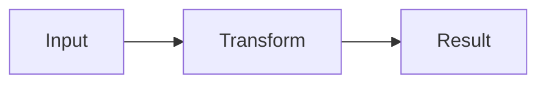

# Beautiful Presenterm

Create presentations that feel intentionally designed for the terminal rather than like documents split into pages.

## Definition of done

A completed deck must:

- Tell one coherent story for a specific audience and desired outcome.
- Use Presenterm-native syntax correctly.
- Be visually restrained, high-contrast, and readable at the intended terminal size.
- Vary slide composition without becoming decorative or inconsistent.
- Keep code, diagrams, images, and animation purposeful.
- Include the source deck, any local assets, a theme when appropriate, and exact run/export commands.
- Be checked for broken paths, accidental overflow, invalid snippets, and unsafe execution settings.

## First choose the operating mode

Infer the mode from the request. Do not force the user through a questionnaire when the available context is sufficient.

### Create

Build a new deck from a topic, outline, notes, documents, or repository.

### Redesign

Preserve the facts and intent of an existing deck while improving hierarchy, pacing, layouts, theme, and wording.

### Technical demo

Prioritize short code snippets, progressive highlighting, architecture diagrams, and an explicit live-demo path plus a non-live fallback.

### Review

Audit an existing deck and return prioritized findings. When asked to fix it, edit the files rather than stopping at critique.

## Workflow

### 1. Establish the brief

Determine, from the request and available files:

- audience and their baseline knowledge;
- presentation goal: teach, persuade, report, pitch, or demonstrate;
- expected duration;
- language and tone;
- whether the deck will be presented live, exported, or both;
- target terminal and approximate viewport;
- whether optional tools such as Mermaid, D2, Typst, or WeasyPrint are available.

When information is missing, make a reasonable assumption and record it briefly in the delivery notes. Use visible placeholders only for facts that cannot be inferred safely.

A useful pacing baseline is roughly one meaningful slide per minute, then adjust for demos and discussion. Do not pad a short idea into a long deck.

### 2. Inspect the source material

For repository-based talks, inspect the actual code, architecture, README, tests, and relevant history before writing claims. Prefer real snippets from the repository over invented pseudo-code.

For notes or documents, extract:

- the single central claim;
- three to five supporting ideas;
- evidence, examples, numbers, or demonstrations;
- the final action or takeaway.

Do not copy prose wholesale into slides. Convert source material into spoken visual beats.

### 3. Build the narrative before styling

Write a private slide map using this shape where appropriate:

1. Hook or promise.
2. Context and stakes.
3. Problem or tension.
4. Key insight.
5. Explanation or evidence.
6. Demonstration or example.
7. Consequences or trade-offs.
8. Resolution and takeaway.
9. Clear closing or call to action.

Not every deck needs every stage. Each slide must earn its place and advance the argument.

### 4. Choose a visual system

Default to the bundled `assets/terminal-noir.yaml` unless the user requests another style or the content calls for a light theme.

Use one dominant foreground, one accent, one secondary accent, and semantic success/warning/error colors. Avoid rainbow syntax outside code. Color must reinforce hierarchy, not compensate for weak structure.

For a portable deck, copy the theme beside the presentation and reference it with a relative path:

```yaml
---
theme:
  path: ./theme.yaml
---
```

For a dependency-free deck, use an exact built-in name such as `tokyonight-night`, `catppuccin-mocha`, `gruvbox-dark`, `dark`, or `terminal-dark`.

### 5. Author with explicit Presenterm syntax

Use explicit slide boundaries by default:

```markdown
<!-- end_slide -->
```

Do not use `---` as a slide separator unless `options.end_slide_shorthand: true` is explicitly enabled. Use Setext headings for ordinary slide titles:

```markdown
A clear slide title
===================
```

Use the introduction front matter only when a formal title slide adds value:

```yaml
---
title: "A concise, specific title"
sub_title: "The promise or angle"
author: "Name"
theme:
  path: ./theme.yaml
options:
  implicit_slide_ends: false
  end_slide_shorthand: false
---
```

Keep a blank line around Presenterm comment commands so the source remains readable.

### 6. Compose slides, do not merely fill them

Use a deliberate mix of these archetypes:

- title or cover;
- large statement or question;
- section divider;
- sparse list;
- comparison;
- two-column explanation;
- code walkthrough;
- diagram or flow;
- image with one insight;
- result or metric;
- summary and closing.

Avoid using the same title-plus-bullets composition more than twice in a row.

#### Density rules

Treat these as strong defaults, not mathematical requirements:

- One primary idea per slide.
- Usually 12–40 words on a normal slide, excluding code and speaker notes.
- No more than four main bullets; each should fit on one visual line when possible.
- No paragraph longer than three short lines.
- No more than one table per slide; keep tables small.
- Keep visible code to roughly 6–18 lines.
- Split complex diagrams instead of shrinking them.
- Preserve empty space. Do not fill the terminal because space is available.

Write slide text for speech: concrete nouns, active verbs, short clauses. Put nuance, citations, transitions, and reminders in speaker notes.

### 7. Use layouts with intent

Two columns work well for text/code, before/after, concept/example, and claim/evidence:

```markdown
<!-- column_layout: [3, 2] -->

<!-- column: 0 -->

Main explanation

<!-- column: 1 -->

Supporting code or image

<!-- reset_layout -->
```

Recommended ratios:

- `[1, 1]` for balanced comparison;
- `[3, 2]` for explanation plus supporting visual;
- `[2, 3]` for visual plus commentary;
- `[1, 3, 1]` with content only in column 1 for a narrower centered block.

Never create columns only to make a slide look busy. Reset the layout before adding full-width content.

### 8. Reveal information sparingly

Use pauses when sequence changes comprehension:

```markdown
First establish the premise.

<!-- pause -->

Then reveal the consequence.
```

For a short list that truly benefits from staged disclosure:

```markdown
<!-- incremental_lists: true -->

- First step
- Second step
- Final implication

<!-- incremental_lists: false -->
```

Do not make every bullet incremental. A deck should remain pleasant when exported, where pause behavior may differ.

### 9. Make code legible and narratable

Prefer a single focused snippet over a wall of code. Include line numbers only when the narration refers to them:

````markdown
```typescript +line_numbers {2-4|6-8|all}
export function total(items: Item[]): number {
  const valid = items.filter(item => item.enabled);
  const subtotal = valid.reduce((sum, item) => sum + item.price, 0);

  const tax = subtotal * 0.21;
  return subtotal + tax;
}
```
````

Use dynamic highlights to guide attention through the same snippet rather than duplicating nearly identical slides.

When the code already exists in the repository, include it as an external file so the presentation does not drift:

````markdown
```file +line_numbers
path: src/example.ts
language: typescript
start_line: 10
end_line: 24
```
````

For executable snippets, hidden setup lines may use `/// ` in Java, Kotlin, JavaScript, TypeScript, Python, shell, C, C++, and Go; Rust uses `# `. Keep hidden setup minimal and understandable from the source.

### 10. Treat execution as privileged

Never add `+exec`, `+auto_exec`, `+exec_replace`, `+image`, or `+acquire_terminal` merely for spectacle.

Only add executable content when:

- the user explicitly wants a live demo or executable deck;
- the source is trusted;
- commands are deterministic and reasonably fast;
- no secrets, destructive operations, network mutations, or broad filesystem writes are involved;
- the deck also explains how execution is enabled.

`+exec` requires opt-in with `-x`. `+exec_replace` and `+image` require stronger opt-in with `-X`. Never enable snippet execution globally on the user's behalf.

Give every live demo a fallback: captured output, a static code/result slide, or a prepared local artifact.

### 11. Use diagrams only when they compress complexity

Mermaid:

````markdown

````

D2:

````markdown
```d2 +render +width:80%
client -> api -> database
```
````

LaTeX or Typst can render formulas with `+render`. These features require external tools; do not introduce them unless available or clearly document the dependency and a fallback.

Keep diagrams to a small number of nodes. Use progressive slides for architecture that cannot be understood at once.

### 12. Handle images portably

Use local relative paths. Remote images are unsupported. Size images explicitly when useful:

```markdown

```

Assume images may fall back to ASCII in unsupported terminals. A slide must remain understandable from its title and accompanying text even if image fidelity is poor.

### 13. Add speaker notes for real talks

Use notes for narration, transitions, timing, source attribution, and demo cues:

```markdown
<!--
speaker_note: |
  Explain why this matters before discussing implementation.
  Transition: “Now that the constraint is clear, we can simplify the design.”
-->
```

Keep visible slides concise; do not turn notes into an essay. When the user asks for speaker notes, include them on every substantive slide.

### 14. Package the result

For a new polished deck, normally create:

```text
presentation/
├── presentation.md
├── theme.yaml
├── presenterm.yaml
├── README.md
└── assets/
```

Use `assets/starter-deck.md`, `assets/terminal-noir.yaml`, and `assets/presenterm.yaml` as starting points, then adapt them rather than copying blindly.

The README should include exact commands for:

- development with hot reload;
- presentation mode;
- optional snippet execution;
- speaker notes when present;
- HTML export;
- PDF export when requested;
- validation.

### 15. Validate and refine

Check the source before declaring completion:

1. Every non-final slide ends correctly.
2. Front matter parses as YAML.
3. Theme path and all local asset paths resolve relative to the deck.
4. Column layouts use valid indices and are reset where needed.
5. No unsupported remote image URLs are used.
6. Code fences close correctly.
7. Optional features have documented dependencies.
8. Executable blocks are intentional and safe.
9. Long lines, tables, diagrams, and code fit the target viewport.
10. The deck has a clear opening, escalation, and ending.

When Presenterm is installed, run the bundled validator:

```bash
./scripts/validate.sh path/to/presentation.md path/to/presenterm.yaml
```

Then inspect the deck interactively at the target size:

```bash
presenterm --config-file path/to/presenterm.yaml path/to/presentation.md
```

Use `T` to inspect the layout grid, and test both normal navigation and fast navigation. For final delivery, use presentation mode:

```bash
presenterm --config-file path/to/presenterm.yaml --present path/to/presentation.md
```

When snippets are present and trusted:

```bash
presenterm --config-file path/to/presenterm.yaml --validate-snippets -x path/to/presentation.md
```

If Presenterm is unavailable, still perform static checks, state that rendering was not executed, and provide the exact commands the user can run.

## Review rubric

Score each category from 1 to 5 and fix the weakest areas first:

- narrative clarity;
- slide-level focus;
- information density;
- visual hierarchy;
- composition variety;
- terminal readability;
- code and diagram quality;
- pacing and reveals;
- portability;
- technical correctness.

A beautiful deck is not the one with the most features. It is the one where every feature makes the audience understand the idea faster.

## Reference material

Read these only as needed:

- [Presenterm syntax and commands](references/presenterm-reference.md)
- [Terminal presentation design playbook](references/design-playbook.md)
