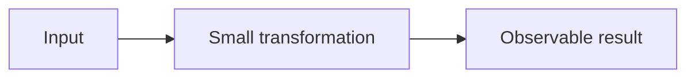

<!-- end_slide -->

<!-- jump_to_middle -->

<span class="muted">OPENING QUESTION</span>

# What changes when the constraint disappears?

<!--
speaker_note: |
  Open with the audience's current mental model.
  Do not explain the answer yet.
-->

<!-- end_slide -->

The problem is not what it seems
================================

<!-- column_layout: [3, 2] -->

<!-- column: 0 -->

Most teams optimize the visible symptom.

<!-- pause -->

The actual bottleneck sits one layer deeper.

<!-- column: 1 -->

> A strong slide makes the audience notice the missing assumption.

<!-- reset_layout -->

<!--
speaker_note: |
  Replace this abstraction with the concrete problem and one piece of evidence.
-->

<!-- end_slide -->

Three facts are enough
======================

<!-- list_item_newlines: 1 -->

- **Fact one** establishes the scale.
- **Fact two** reveals the constraint.
- **Fact three** creates urgency.

<!-- end_slide -->

The key insight
===============

<!-- jump_to_middle -->

# <span class="accent">Simplify the system</span>, not the explanation.

<span class="muted">One memorable sentence. No supporting clutter.</span>

<!-- end_slide -->

From input to outcome
=====================



<!--
speaker_note: |
  Keep this diagram only when Mermaid is available.
  Otherwise replace it with three textual stages or a local image.
-->

<!-- end_slide -->

The implementation fits on one screen
======================================

```typescript +line_numbers {2-3|5-6|all}
export function total(items: Item[]): number {
  const active = items.filter(item => item.enabled);
  const subtotal = active.reduce((sum, item) => sum + item.price, 0);

  const tax = subtotal * 0.21;
  return subtotal + tax;
}
```

<!--
speaker_note: |
  First explain filtering, then aggregation, then the final policy decision.
-->

<!-- end_slide -->

The trade-off is explicit
=========================

| Choice | Strength | Cost |
|:--|:--|:--|
| **Simple path** | Easy to operate | Less flexibility |
| Flexible path | Handles edge cases | More moving parts |

<!-- end_slide -->

What to remember
================

<!-- incremental_lists: true -->

- Start with the audience's constraint.
- Reveal one idea at a time.
- Make the final action unmistakable.

<!-- incremental_lists: false -->

<!-- end_slide -->

<!-- jump_to_middle -->

# <span class="accent">The next step is clear.</span>

Replace this line with the specific action, decision, or question.
