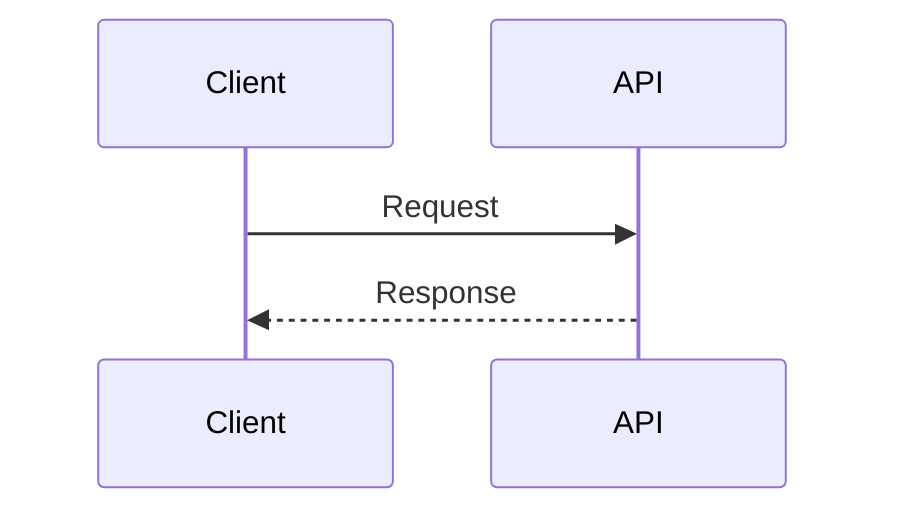

# Presenterm reference for deck generation

Use this file as a compact syntax reference. Prefer the official Presenterm documentation when behavior differs by version.

## Minimal deck

```markdown
---
title: "Title"
sub_title: "Subtitle"
author: "Author"
theme:
  name: tokyonight-night
---

<!-- end_slide -->

First idea
==========

Content

<!-- end_slide -->

Final idea
==========

Content
```

A presentation is one Markdown file. The explicit slide separator is `<!-- end_slide -->`. Setext headings are treated as slide titles.

## Front matter

```yaml
---
title: "Markdown is allowed here"
sub_title: "Optional"
author: "One author"
authors:
  - "Or"
  - "Multiple authors"
event: "Optional event"
location: "Optional location"
date: "Optional date"
theme:
  path: ./theme.yaml
options:
  implicit_slide_ends: false
  end_slide_shorthand: false
  h1_slide_titles: false
  incremental_lists: false
---
```

Use either `author` or `authors`, not both. A theme may be selected with `theme.name`, `theme.path`, light/dark variants, or `theme.override`.

Built-in theme names include:

- `catppuccin-latte`
- `catppuccin-frappe`
- `catppuccin-macchiato`
- `catppuccin-mocha`
- `dark`
- `gruvbox-dark`
- `light`
- `terminal-dark`
- `terminal-light`
- `tokyonight-day`
- `tokyonight-moon`
- `tokyonight-night`
- `tokyonight-storm`

Use `presenterm --list-themes` to preview them.

## Comment commands

```markdown
<!-- end_slide -->
<!-- pause -->
<!-- jump_to_middle -->
<!-- font_size: 2 -->
<!-- new_line -->
<!-- new_lines: 3 -->
<!-- incremental_lists: true -->
<!-- incremental_lists: false -->
<!-- list_item_newlines: 2 -->
<!-- include: chapter.md -->
```

Use `presenterm --list-comment-commands` for the version-specific list.

## Columns

```markdown
<!-- column_layout: [3, 2] -->

<!-- column: 0 -->

Left content

<!-- column: 1 -->

Right content

<!-- reset_layout -->
```

Column indexes start at zero. Layouts end automatically with the slide, but use `reset_layout` before returning to full-width content.

## Pauses and incremental lists

```markdown
Visible first

<!-- pause -->

Visible after advancing
```

```markdown
<!-- incremental_lists: true -->

- One
- Two
- Three

<!-- incremental_lists: false -->
```

Avoid global incremental lists unless the entire deck was designed around that behavior.

## Text styling

```markdown
<span style="color: #7aa2f7">Hex color</span>
<span style="color: palette:accent">Palette color</span>
<span class="badge">Theme class</span>
```

Presenterm supports `span` tags for color styling. Keep color usage semantic and sparse.

## Images

```markdown


```

Paths are relative to the presentation file. Remote images are not supported. Rendering uses kitty, iTerm2, or sixel where available and may fall back to ASCII.

## Code highlighting

````markdown
```java +line_numbers
record User(long id, String name) {}
```
````

Selective highlighting:

````markdown
```typescript {1,3,5-7}
// code
```
````

Dynamic highlighting:

````markdown
```typescript {1-2|4-6|all}
// code
```
````

Each `|` adds a navigation frame within the slide.

## External code files

````markdown
```file +line_numbers
path: src/service.ts
language: typescript
start_line: 12
end_line: 28
```
````

Omit `start_line` and `end_line` to include the whole file. Paths are relative to the deck.

## Executable snippets

````markdown
```bash +exec +id:demo
printf 'hello\n'
```

<!-- snippet_output: demo -->
````

- `+exec`: execute with `Ctrl+E`; requires `-x` or explicit config opt-in.
- `+auto_exec`: execute automatically, with the same trust concerns.
- `+exec_replace`: execute and replace source with output; requires `-X`.
- `+image`: execute and render emitted JPG/PNG; same opt-in as `+exec_replace`.
- `+pty` or `+pty:80:30`: run in a pseudo terminal.
- `+acquire_terminal`: temporarily give the process the terminal.
- `+validate`: validate during development without making the snippet interactive.
- `+expect:failure`: mark an expected non-zero exit.

Use `--validate-snippets` to validate executable and validation snippets. Do not run untrusted decks with execution enabled.

Hidden executable setup lines:

- Rust: prefix with `# `.
- Java, Kotlin, JavaScript, TypeScript, Python, Bash, Fish, Shell, Zsh, C, C++, Go: prefix with `/// `.

## Rendered diagrams and formulas

Mermaid:

````markdown

````

D2:

````markdown
```d2 +render +width:75%
client -> api -> db
```
````

LaTeX and Typst also use `+render`. Mermaid requires Mermaid CLI; D2 requires D2; formula rendering requires Typst, and LaTeX rendering also requires Pandoc.

## Speaker notes

Single line:

```markdown
<!-- speaker_note: Remember the transition -->
```

Multiline:

```markdown
<!--
speaker_note: |
  Explain the context.
  Pause before revealing the result.
-->
```

Run the presenter and note viewer in separate terminals:

```bash
presenterm deck.md --publish-speaker-notes
presenterm deck.md --listen-speaker-notes
```

## Configuration file

Presentation behavior that is not front-matter-compatible belongs in a config file:

```yaml
# yaml-language-server: $schema=https://raw.githubusercontent.com/mfontanini/presenterm/master/config-file-schema.json

defaults:
  max_columns: 100
  max_columns_alignment: center
  max_rows: 32
  max_rows_alignment: center
  validate_overflows: when_developing

transition:
  duration_millis: 320
  frames: 20
  animation:
    style: fade

export:
  dimensions:
    columns: 100
    rows: 32
  pauses: new_slide
```

Supported transition styles include `fade`, `slide_horizontal`, and `collapse_horizontal`. Favor subtle settings.

## Run and export

Development with hot reload:

```bash
presenterm --config-file presenterm.yaml presentation.md
```

Presentation mode:

```bash
presenterm --config-file presenterm.yaml --present presentation.md
```

HTML export, self-contained:

```bash
presenterm --config-file presenterm.yaml --export-html presentation.md --output presentation.html
```

PDF export with WeasyPrint:

```bash
uv run --with weasyprint presenterm \
  --config-file presenterm.yaml \
  --export-pdf presentation.md \
  --output presentation.pdf
```

## Useful runtime keys

- next/previous: arrows, `hjkl`, page up/down;
- first/last: `gg`, `G`;
- go to slide: `<number>G`;
- slide index: `Ctrl+P`;
- help: `?`;
- layout grid: `T`;
- execute snippet: `Ctrl+E`;
- quit: `Ctrl+C` or `q` depending on configuration.

## Official documentation

- https://mfontanini.github.io/presenterm/
- https://mfontanini.github.io/presenterm/features/introduction.html
- https://mfontanini.github.io/presenterm/features/commands.html
- https://mfontanini.github.io/presenterm/features/layout.html
- https://mfontanini.github.io/presenterm/features/code/highlighting.html
- https://mfontanini.github.io/presenterm/features/code/execution.html
- https://mfontanini.github.io/presenterm/features/themes/introduction.html
- https://mfontanini.github.io/presenterm/features/themes/definition.html
- https://mfontanini.github.io/presenterm/configuration/introduction.html
- https://mfontanini.github.io/presenterm/configuration/options.html
- https://mfontanini.github.io/presenterm/configuration/settings.html
